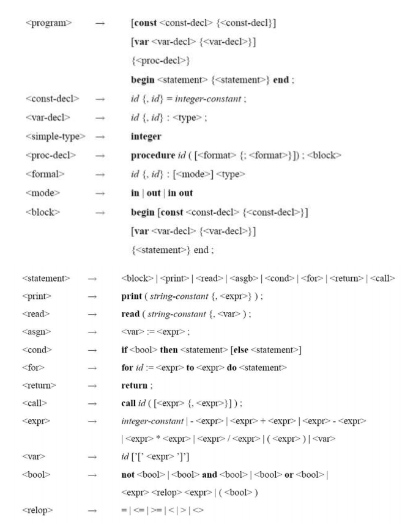

# Simple-Compiler-Python

Simple Compiler Project using Python Language 

For run the Project go to /src and run the comment below :

If your python version is 2 or older

`pyhton main.py`

If your python version is 3 or higher 

`pyhton3 main.py`

Grammer Picture :

  

